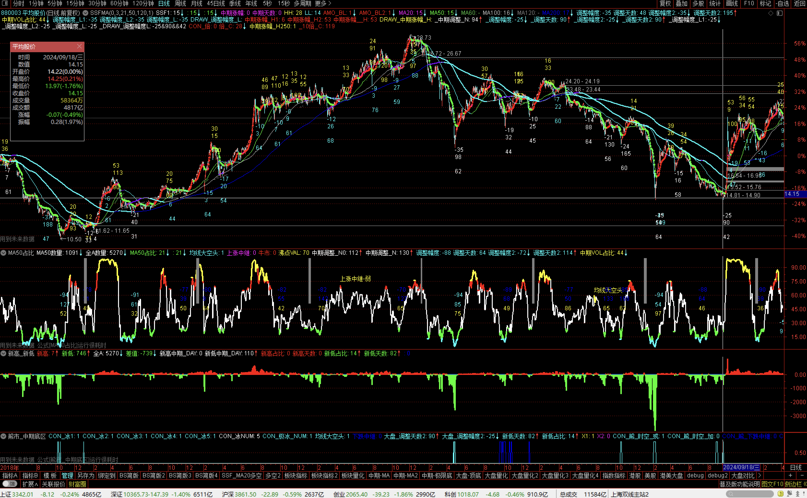

# tdx
通达信


[雪球](https://xueqiu.com/u/baiwantubiao)

[动量交易技术汇总](https://xueqiu.com/3020923714/291880876)


---


# 大盘量化 - 概览


### 大盘-顶底




```
主：


50日线占比

```

```
辅：


新高—新低


板块-月多占比
个股-月多占比


板块-BS占比

```


TODO 


---


# 板块量化 - 概览


// TODO


---


# 个股量化 - 概览


// TODO


---

# 主要适配 A股   

### 港美股   待续...

⌛️   2026   


🔎   也可自行套用    