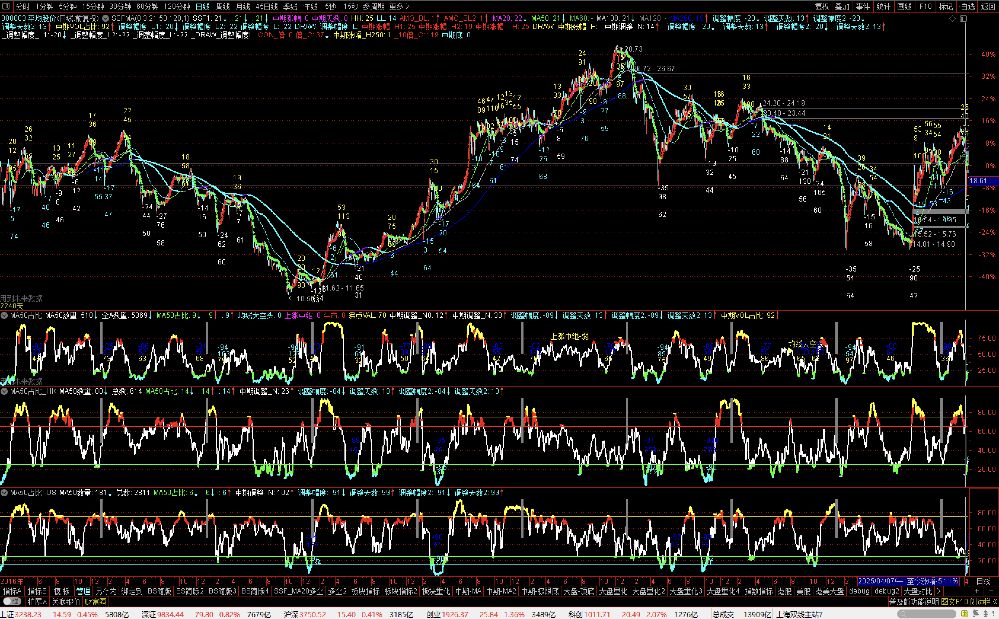

# tdx


[雪球](https://xueqiu.com/u/baiwantubiao)

[动量交易技术汇总](https://xueqiu.com/3020923714/291880876)


---

[通达信-量化交易](https://github.com/bebopze/tdx-quant)


---

# 通达信-量化指标：


[主图](主图)

[副图](副图)


---


# 大盘量化 - 概览


### 大盘-中期顶底


```
主：


50日线占比

```

```
辅：


新高—新低


板块-月多占比
个股-月多占比


板块-BS占比

```

```
汇总：

大盘-中期顶底

```


---


# 板块量化 - 概览


[板块量化](副图/BS状态/BS板块.txt)


---


# 个股量化 - 概览


[个股量化](副图/个股量化)


---

# 主要适配 A股   

### 港美股   待续...

⌛️   2026   


🔎   也可自行套用    


#


#

---

# A港美-大盘对比

🔎   错峰交易 / 行情共振 / ... 

⌛️   2026


